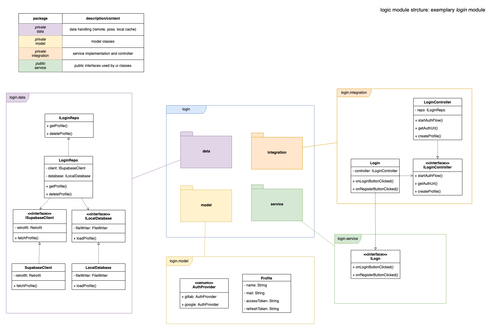

# 05_Bausteinsicht

## 1. Module

Folgende Abbildung zeigt die Module und deren Zusammenarbeit. Die Module wurden aufgrund des Common Closure Principles (CCP) so gewählt. Klassen, die zusammen geändert werden, gehören zusammen.  Der Aufbau hat folgende Vorteile:

- die Module können getrennt voneinander entwickelt werden
- die Module können unabhängig voneinander geändert werden
- ohne Nebenwirkungen durch andere Bausteine mit identischer Schnittstelle ausgetauscht werden

| Modulname | Beschreibung                                                 |
| --------- | ------------------------------------------------------------ |
| ui        | User interface (javafx controller classes & fxml, css, media) |
| root      | Einstiegspunkt & Guice DI Module                             |
| login     | Login Logik (including user authentication)                  |
| start     | Start/Dashboard Logik                                        |
| team      | Team Logik                                                   |
| editor    | Markdown editor Logik                                        |
| docu      | Arc42 & design Dokumentation-Struktur Logik                  |
| api       | Backend Kommunikation (Supabase) & Api Verbindung (Gitlab: Markdown) , Modul ggf. nicht notwendig -> wird sich im Entwicklungsprozess zeigen |

-----

## 2. Modulaufbau & Packageaufbau

### 2.1 Logik Modul

Folgende Abbildung zeigt den Aufbau eines Logik-Moduls exemplarisch anhand des Login-Moduls. Zudem wird der exemplarische Inhalt der einzelnen Packages dargestellt. Nach Bedarf können weitere, notwendige Klassen ergänzt werden. 
Nur das *Service*-Package wird in der `module-info.java` exportiert. Alle anderen Packages sind für die anderen Module nicht sichtbar. 

| Packagename           | Beschreibung                                                 |
| --------------------- | ------------------------------------------------------------ |
| data (private)        | Datenverarbeitung (remote und evtl. local caching)           |
| model (private)       | Model Klassen (= Daten Klassen evtl. sogar Records)          |
| service (public)      | Öffentliche Schnittstelle des Moduls (verwendet von UI Klasse) |
| integration (private) | Implementierung der Schnittstelle und Logik des Moduls       |

### 2.2 UI Modul

Folgende Abbildung zeigt den Aufbau des UI-Moduls. Zu jedem Logik-Modul (siehe Module) gibt es ein zugehöriges UI-Package. Die UI-Klassen machen jeweils von der entsprechenden Logik-Schnittstelle gebrauch (siehe service Package bei Modulaufbau).
*Hinweis*: Es wäre sinnvoller die fxml-files und css-files jeweils in den dazugehörigen Packages zu halten, anstatt im resources Directory. Dies ist jedoch aufgrund von JavaFx-Vorgaben nicht möglich.

